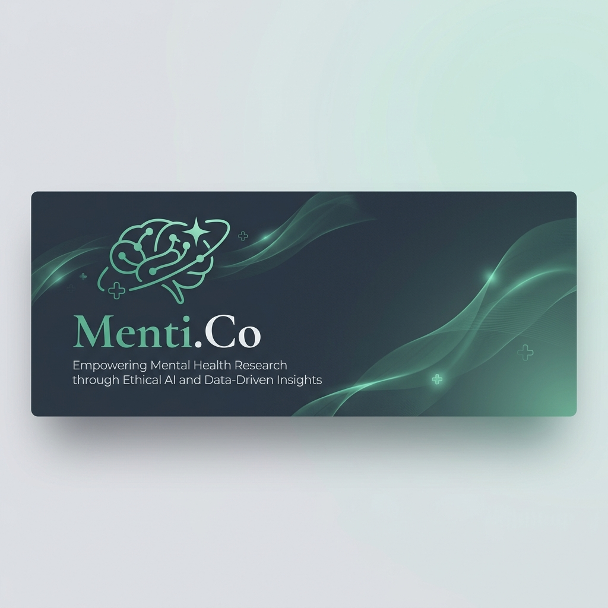
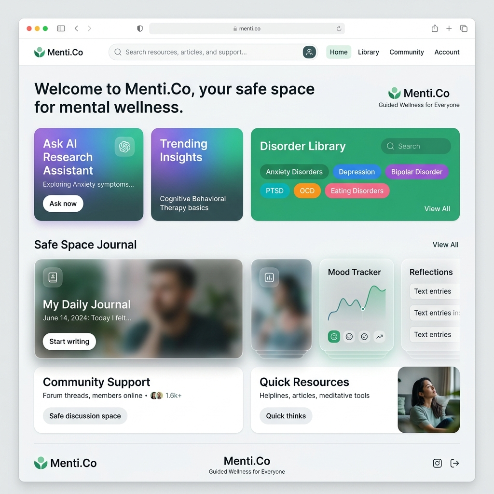

<div align="center">



# Menti.Co 🧠
### Empowering Mental Health Through Evidence-Based Research

[](https://nextjs.org/)
[](https://fastapi.tiangolo.com/)
[](https://www.postgresql.org/)
[](https://qdrant.tech/)
[](LICENSE)

[**Explore the Library**](http://localhost:3000) • [**API Docs**](http://localhost:4000/docs) • [**Contribute**](#contributing)

</div>

---

## 🌟 Overview

**Menti.Co** is a state-of-the-art mental health research platform designed to bridge the gap between complex clinical data and accessible patient care. We leverage **AI-driven semantic search**, **vector embeddings**, and **real-time ingestion** to provide a calming, evidence-based sanctuary for mental health education.

### ✨ Key Features

- 🔍 **AI Research Assistant**: Semantic search powered by `all-MiniLM-L6-v2` and cross-encoder re-ranking for ultra-precise results.
- 📝 **Safe Space Journal**: A private, empathetic journaling interface with real-time crisis detection and support resources.
- 📚 **Clinical Library**: Automated ingestion of 500+ peer-reviewed papers from PubMed, categorized by disorder and treatment.
- 🏥 **Practitioner Discovery**: Geolocation-aware search to find the nearest mental health professionals.
- 🎨 **Material You Design**: A stunning, responsive bento-grid UI that feels alive, supportive, and professional.

---

## 📸 Visual Experience

<div align="center">
  
</div>

---

## 🛠️ Technology Stack

| Core | Database & Search | Intelligence |
| :--- | :--- | :--- |
| **Frontend**: Next.js 15 (App Router) | **Vector DB**: Qdrant Cloud | **Embeddings**: Sentence Transformers |
| **Backend**: FastAPI (Python 3.12) | **Relational**: PostgreSQL (pgvector) | **LLM**: Ollama / Llama 3 |
| **Styling**: Tailwind CSS & Framer Motion | **Search**: Elasticsearch 8 | **Tasks**: Celery & Redis |

---

## 🏗️ Architecture

Menti.Co is structured as a modern monorepo for seamless development:

```bash
├── 📂 backend
│   ├── 📂 api        # FastAPI Research API
│   ├── 📂 worker     # Celery background ingestion service
│   ├── 📂 scripts    # Database migrations & PubMed ingestion
│   └── 📂 packages   # Shared backend logic & types
├── 📂 frontend
│   ├── 📂 web        # Next.js 15 Web Application
│   └── 📂 packages   # Shared UI components & primitives
└── 📂 docs           # Visual assets and documentation
```

---

## 🚀 Getting Started

### 1. Prerequisites
- **Python 3.12+** & **uv** (Package Manager)
- **Node.js 20+** & **npm**
- **Docker** (Optional, for local services)
- **Ollama** (For local AI summaries)

### 2. Installation
```bash
# Clone the repository
git clone https://github.com/your-username/Menti.Co.git
cd Menti.Co

# Install dependencies
npm install
make setup
```

### 3. Environment Setup
Copy the example environment file and fill in your keys:
```bash
cp .env.example .env
```

### 4. Database & Ingestion
```bash
make migrate   # Initialize database schema
make ingest    # Seed research data from PubMed
```

### 5. Start Development
```bash
# In separate terminals, or use concurrently:
make dev       # Starts both API and Web servers
```

---

## 🛡️ Clinical Disclaimer

Menti.Co is an educational research tool and **not a substitute for professional medical advice, diagnosis, or treatment**. Always seek the advice of your physician or other qualified health provider with any questions you may have regarding a medical condition.

---

<div align="center">
  <sub>Built with ❤️ by the Menti.Co Team. Join us in making mental health research accessible to everyone.</sub>
</div>
